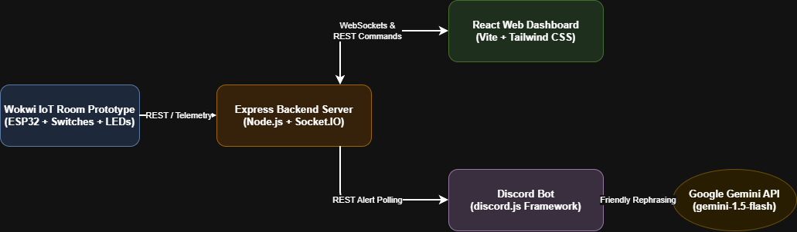
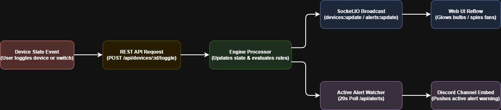
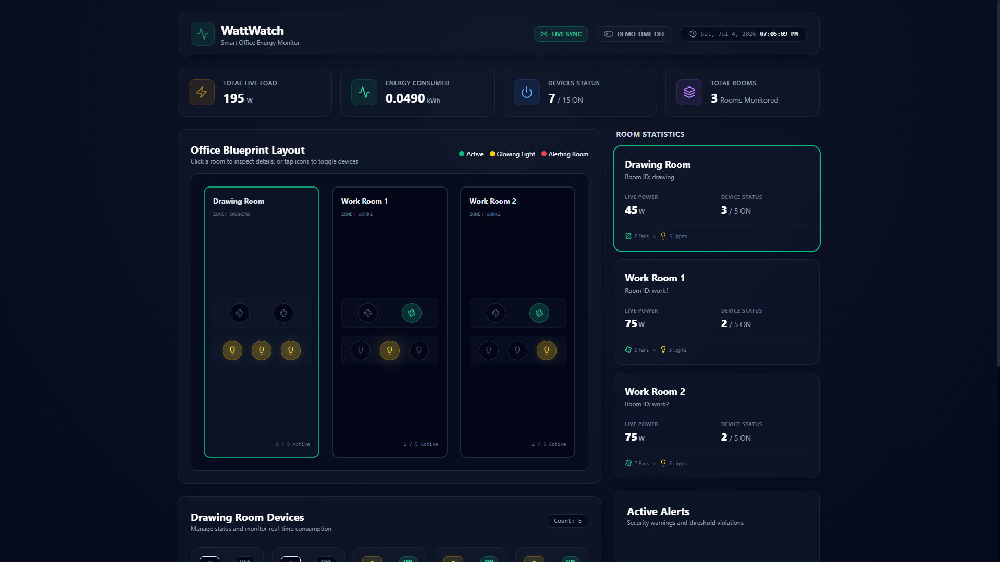
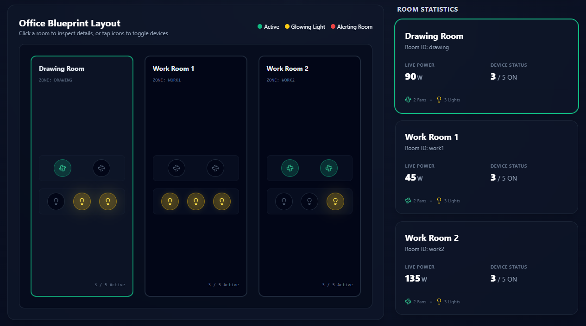
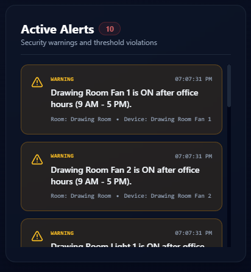
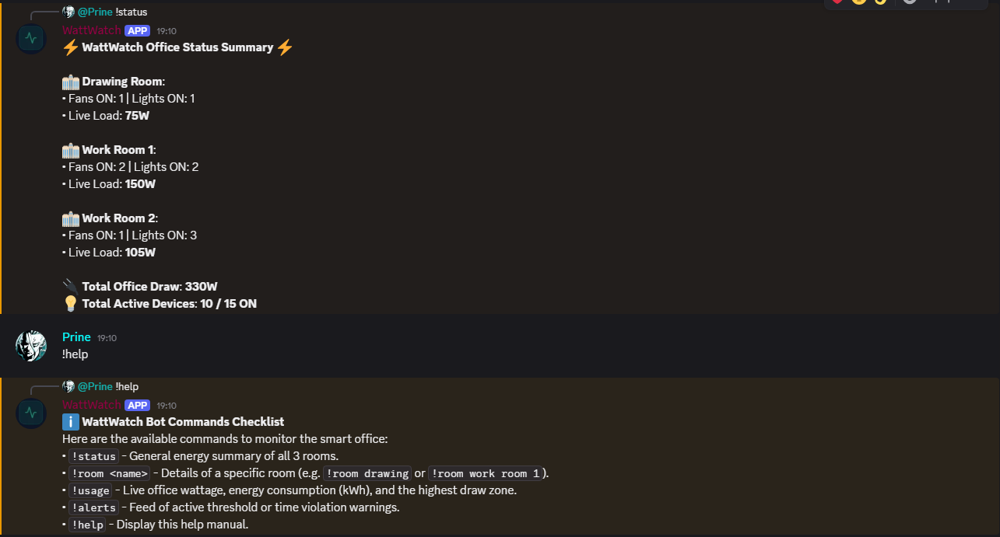
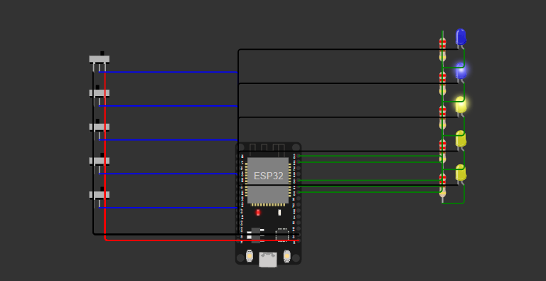

# WattWatch

Smart office energy monitoring dashboard and Discord bot using simulated IoT data.

---

## Important Links

- **Live Dashboard**: [https://watt-watch-gamma.vercel.app/](https://watt-watch-gamma.vercel.app/)
- **Backend API**: [https://wattwatch-ai-iot-office-device-monitoring-system-production.up.railway.app](https://wattwatch-ai-iot-office-device-monitoring-system-production.up.railway.app)
- **Wokwi Circuit**: `<paste your Wokwi room simulation link here>`
- **Demo Video**: `<paste your Loom or YouTube video link here>`
- **System Architecture Diagram**: [diagrams/system-architecture.drawio.png](diagrams/system-architecture.drawio.png)
- **Data Flow Diagram**: [diagrams/data-flow.drawio.png](diagrams/data-flow.drawio.png)

---

## 1. Problem Summary
In modern offices, electrical appliances like fans and lights are frequently left running in unoccupied rooms after office hours or during lunch breaks. This leads to avoidable electricity waste, unnecessary energy waste, and higher operational cost. To solve this, the office administration ("the boss") requires a centralized, real-time energy monitoring dashboard to track active loads, alongside an AI-integrated Discord bot to query live status, fetch consumption metrics, and automatically alert team members of power anomalies.

---

## 2. Solution Overview
WattWatch addresses this issue using a complete web and chat monitoring system:
1. **Wokwi One-Room Hardware Concept**: Demonstrates how one physical room could be wired.
2. **Backend Simulated Device Layer**: An Express.js REST API and Socket.IO WebSockets server that manages state, computes live usage statistics (Watts, accumulated kWh), evaluates rule-based warnings, and broadcasts updates.
3. **Web Dashboard**: A React, Vite, and Tailwind CSS single-page application displaying real-time office floor layouts with animated fans, glowing lights, and interactive controls to override device states.
4. **Discord Bot**: An interactive chatbot that queries the backend, leverages the Gemini API to format stats into natural, friendly language, and polls the API to proactively push alerts directly to team channels.

```
[Wokwi One-Room Hardware Concept]
              │
              ▼
[Backend Simulated Device Layer]
              │
              ▼
[Node.js Express + Socket.IO Backend]
        /                              \
       ▼                                ▼
[React Dashboard]              [Discord Bot] ──► [Gemini API]
```
*Note: The Wokwi circuit demonstrates how one physical room could be wired. The live demo uses the backend simulator as the active data source.*

---

## 3. Requirement Coverage

| Requirement | WattWatch Implementation |
| :--- | :--- |
| **High-level system diagram** | Included in `diagrams/system-architecture.drawio.png` |
| **Hardware/electrical schematic** | Wokwi ESP32 one-room circuit in `circuit/` |
| **Simulated device data** | Backend simulator creates dynamic states for 15 devices |
| **Web dashboard** | React dashboard with live status, power, alerts, and office layout |
| **Discord bot** | `discord.js` bot using the same backend data |
| **Shared backend** | Express backend is the single source of truth |
| **Real-time updates** | Socket.IO updates dashboard without refresh |
| **Demo video** | Linked in Important Links section |

---

## 4. Exact Office Setup
The WattWatch workspace manages exactly **3 rooms** containing a total of **15 devices**:

| Room ID | Room Name | Fans (60W each) | Lights (15W each) | Total Devices | Maximum Load |
| :--- | :--- | :---: | :---: | :---: | :---: |
| `drawing` | Drawing Room | 2 | 3 | 5 | 165 W |
| `work1` | Work Room 1 | 2 | 3 | 5 | 165 W |
| `work2` | Work Room 2 | 2 | 3 | 5 | 165 W |
| **Total** | **3 Rooms** | **6 Fans** | **9 Lights** | **15 Devices** | **495 W** |

---

## 5. System Architecture



The system uses the backend as the single source of truth. The simulated device layer updates the backend, while the dashboard receives live Socket.IO updates and the Discord bot reads the same backend through REST APIs. 

---

## 6. Data Flow



Device state changes are simulated in the backend, power and alerts are recalculated, and updates are sent to both the dashboard and Discord bot interfaces.

---

## 7. Key Features
- **15 Simulated Devices**: Modeled with realistic default wattages (60W per fan, 15W per light).
- **Real-Time Web Dashboard**: Responsive CSS layout visualizing active loads and device indicators.
- **Room-Wise Monitoring**: Separate room stats tracking drawing room, work room 1, and work room 2.
- **Live Power Calculation**: Real-time aggregation of active draw (W) and accumulated consumption (kWh).
- **Active Alerts Engine**: Checks for after-hours activity, fully active rooms, and total load thresholds.
- **Discord Integration**: Prefix command routing to query snapshots, usage, and room details.
- **Gemini-Friendly Responses**: Dynamic natural language summarization with robust markdown fallbacks.
- **Wokwi Circuit Concept**: ESP32 microcontroller prototype representing a single-room deployment.
- **Deployment-Ready**: Structured environment files and package scripts ready for Render and Vercel.

---

## 8. Project Structure

```text
wattwatch/
├── backend/        # Express API, simulator, Socket.IO, alert engine
├── dashboard/      # React + Vite dashboard
├── discord-bot/    # Discord bot with Gemini response formatting
├── circuit/        # Wokwi circuit link, screenshot, explanation
├── diagrams/       # System architecture and data-flow diagrams
├── demo/           # Demo screenshots and video script
└── README.md
```

---

## 9. Quick Start

### 1. Backend
```bash
cd backend
npm install
npm run dev
```
Backend runs at: `http://localhost:5000`  
Test: `http://localhost:5000/api/snapshot`

### 2. Dashboard
```bash
cd dashboard
npm install
npm run dev
```
Dashboard runs at: `http://localhost:5173`

### 3. Discord Bot
```bash
cd discord-bot
npm install
npm start
```

---

## 10. Backend API Documentation

All routes are prefixed with `/api`:

| Method | Endpoint | Description |
| :--- | :--- | :--- |
| **GET** | `/api/health` | Check backend server status |
| **GET** | `/api/devices` | Retrieve all 15 devices |
| **GET** | `/api/rooms` | Get room-wise summaries |
| **GET** | `/api/usage` | Get live wattage and kWh |
| **GET** | `/api/alerts` | Get active alerts |
| **GET** | `/api/snapshot` | Get devices, usage, alerts, and demo time |
| **POST** | `/api/devices/:id/toggle` | Toggle one device |
| **POST** | `/api/demo/force-alerts` | Force demo alerts |
| **POST** | `/api/demo/reset` | Reset demo state |
| **POST** | `/api/demo/time` | Override demo hour |

---

## 11. Socket.IO Broadcast Events
The server uses Socket.IO to push updates instantly on the following channels:
- `snapshot`: Broadcasts a full combined state payload on client connection or major reset.
- `devices:update`: Dispatched whenever a device's status is toggled.
- `usage:update`: Broadcasts updated energy totals and live load counts every 1 second.
- `alerts:update`: Dispatched when active alerts are re-evaluated.
- `alert:new`: Triggered individually when a new warning condition is met.

---

## 12. Dashboard Features
- **Aggregate Stat Cards**: Displays total live power consumption (W), cumulative energy (kWh), active device counts, and rooms.
- **Top-Down Office Blueprint**: A visual HTML/CSS map representing the office layout. Active fans spin dynamically, active lights display a warm yellow glow, and alerting rooms flash with a red boundary animation.
- **Interactive Control Panel**: Lists all devices in the selected room, allowing users to override statuses manually.
- **Alarms Panel**: Displays current warnings labeled by severity level.
- **Time Override Toggle**: Allows toggling "Demo Time" directly next to the sync status badge to simulate different hours and inspect after-hours rules.
- **Demo Controls**: Quick action buttons to force alerts, reset simulation variables, or refresh state.

### Dashboard Visual Previews

#### Main Dashboard Overview


#### Real-Time Interactive Floorplan Layout


#### Active Rule Anomalies Feed


---

## 13. Discord Bot Commands
The chatbot listens for the prefix `!` in the configured Discord server/channel:
- **`!help`**: Returns the list of commands and syntax guide.
- **`!status`**: Summarizes active fan/light counts and load per room, plus total office power.
- **`!room <name>`**: Shows device lists and warnings for a room (aliases like `!room drawing room` or `!room work room 2` are tolerated).
- **`!usage`**: Shows live load, kWh energy, and the room drawing the most power.
- **`!alerts`**: Shows active warnings (or system nominal status).

### Discord Bot Visual Preview

#### Interactive Gemini Command Summary


---

## 14. Gemini API Integration
The bot leverages Google's **Gemini 1.5 Flash API** to rewrite technical JSON response facts into friendly, natural messages. 
- **Facts Enforcement**: The prompt instructs the model strictly to preserve all numbers, device names, room counts, and active alert descriptions. Gemini is only used to format the presentation tone.
- **Resilient Fallback**: If `GEMINI_API_KEY` is omitted or calls are throttled, the bot automatically falls back to clean, pre-formatted Markdown templates, ensuring 100% uptime.

---

## 15. Wokwi ESP32 Representative Circuit

The Wokwi simulation represents **one room** of WattWatch. Each room has the same structure: 2 fans and 3 lights. Therefore, this one-room circuit can be repeated three times to represent the complete office setup of 15 devices.

### Hardware Prototyping Details
- **Microcontroller**: ESP32 DevKit v1
- **Inputs**: 5 Slide Switches representing virtual device state toggles:
  - Switch 1: Fan 1
  - Switch 2: Fan 2
  - Switch 3: Light 1
  - Switch 4: Light 2
  - Switch 5: Light 3
- **Outputs**: 5 LEDs signaling device ON/OFF load activation (visualizing status).
- **Behavior**: The ESP32 monitors switch inputs and updates indicators. In a physical production environment, these LEDs correspond to smart relay outputs (e.g., solid-state relays or current sensors) controlling actual fans and lights.

- **Wokwi Link**: `<paste your Wokwi room simulation link here>`

### Wokwi Hardware Visual Preview

#### ESP32 Wiring Schematic


---

## 16. Environment Variables

### Backend (`/backend/.env`)
```env
PORT=5000
NODE_ENV=development
CLIENT_URL=http://localhost:5173
DEMO_MODE=true
```

### Dashboard (`/dashboard/.env`)
```env
VITE_BACKEND_URL=http://localhost:5000
```

### Discord Bot (`/discord-bot/.env`)
```env
DISCORD_TOKEN=your_discord_bot_token_here
DISCORD_CHANNEL_ID=your_alerts_channel_id_here
BACKEND_URL=http://localhost:5000
GEMINI_API_KEY=your_google_gemini_api_key_here
```

---

## 17. Deployment Steps

### Backend (Render/Railway)
1. Create a new **Web Service** on Render/Railway and link your GitHub repository.
2. Select **Node** environment. Set the build command to `npm install` and start command to `npm start` (pointing to `backend` root).
3. In Environment Variables, define `PORT=5000`, `DEMO_MODE=true`, and `CLIENT_URL` pointing to your frontend Vercel URL.

### Dashboard (Vercel)
1. Add a new project on Vercel and select the `/dashboard` folder.
2. Set Build Command to `npm run build` and Output Directory to `dist`.
3. Add the environment variable `VITE_BACKEND_URL` pointing to your deployed Railway/Render URL.

### Discord Bot
1. Deploy as a background service/worker (e.g. on Railway or Render) with no web ports exposed.
2. Add your environment variables (`DISCORD_TOKEN`, `DISCORD_CHANNEL_ID`, `BACKEND_URL`, `GEMINI_API_KEY`).
3. Run using `npm start`.

---

## 18. Complete 3-Minute Demo Video Script

A detailed sequence mapping presentation timings, on-screen actions, and speech text:

### 1. Problem & Hook (0:00 - 0:20)
- **Visual Action**: Display the React Web Dashboard home screen.
- **Presenter Speech**:
  > *"Hello judges! Welcome to **WattWatch**. In modern office environments, electrical appliances like fans and lights are frequently left running in unoccupied rooms, leading to avoidable electricity waste, unnecessary energy waste, and higher operational cost. WattWatch solves this problem by integrating a central monitoring dashboard, automated alert dispatching, and a natural-language Discord assistant."*

### 2. System Architecture (0:20 - 0:50)
- **Visual Action**: Switch to the system architecture diagram in your slides.
- **Presenter Speech**:
  > *"Our system uses the backend as the single source of truth. The simulated device layer updates the backend, while the dashboard receives live Socket.IO updates and the Discord bot reads the same backend through REST APIs. Telemetry flows asynchronously from device states to clients without lag."*

### 3. Dashboard Live Status (0:50 - 1:30)
- **Visual Action**: Go back to the dashboard at `https://watt-watch-gamma.vercel.app/`. Show the aggregate power metrics and rotating fans. Click the toggle switch next to any light.
- **Presenter Speech**:
  > *"Here is our React dashboard showing 3 rooms and exactly 15 devices. When I manually toggle this device off, the total live load immediately drops and updates without page refresh. Active fans spin, and active lights display a warm glow to give admins clear visual feedback."*

### 4. Alerts & Power Usage (1:30 - 2:00)
- **Visual Action**: Toggle **DEMO TIME ON** in the header. Set the hours dropdown to **10:00 PM** (after-hours).
- **Presenter Speech**:
  > *"WattWatch automatically catches anomalies. If devices are running outside office hours (9 AM - 5 PM), the room outline pulses red and warnings appear in our alert feed. If we exceed a safe threshold like 400 Watts, an alarm triggers instantly."*

### 5. Discord Bot Commands (2:00 - 2:30)
- **Visual Action**: Go to your Discord channel. Send `!status` and display the formatted reply. Then send `!usage`.
- **Presenter Speech**:
  > *"Admins can query stats in Discord. Gemini formats raw facts into friendly updates, falling back to clean Markdown if the API throttles. In the background, our watcher checks for alerts every 20 seconds and announces them as rich embeds."*

### 6. Wokwi ESP32 Circuit (2:30 - 2:45)
- **Visual Action**: Switch to the Wokwi schematic page or screenshot.
- **Presenter Speech**:
  > *"The Wokwi circuit demonstrates how one physical room could be wired. Each room contains 2 fans and 3 lights. Repeating this structure three times models the entire 15-device office layout. The ESP32 drives indicator LEDs which represent physical relay outputs in production."*

### 7. Closing & Core Philosophy (2:45 - 3:00)
- **Visual Action**: Return to the live dashboard. Point to the connection sync badge.
- **Presenter Speech**:
  > *"By maintaining a single source of truth in the backend, WattWatch ensures that dashboard views, hardware models, and Discord feeds stay in lockstep. Thank you!"*

---

## 19. Future Improvements
- **Hardware Integration**: Use physical smart relays (e.g. Sonoff, Shelly) and true current sensors (like SCT-013).
- **MQTT Broker Communication**: Transition backend links to MQTT for lighter telemetry transport.
- **Cloud Database Integration**: Add MongoDB or PostgreSQL to persist settings.
- **User Authentication**: Secure device overrides with role-based logins.
- **Historical Energy Analytics**: Provide charts tracking power usage trends over weeks/months.
- **Mobile Application**: Build a React Native app for on-the-go notifications.
